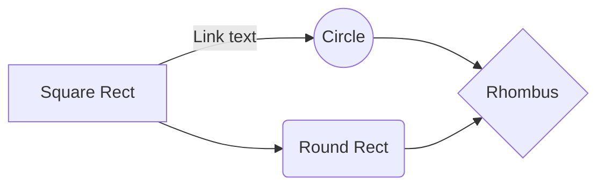

# GIT

* Controle de versão
* Armazenamento na nuvem
* Trabalho em equipe
* Melhorar seu código
* Reconhecimento

## SHA1

* algoritmo de encriptação
* resultado representado por 40 caracteres
* também é uma forma de identificar um arquivo
* ex: openssl sha1 texto.txt -> SHA1(texto.txt)= e8d3f4c6d21c4a373219aec4c91a2f080185dcc3
* git usa sh1 para identificar se o arquivo sofreu alguma modificação

### Objetos fundamentais

### BLOB -> armazena o conteudo e um metadado

>Blob <tamanho>
>\0
>conteudo

``` shell
$ echo 'conteudo' | git hash-object --stdin
fc31e91b26cf85a55e072476de7f263c89260eb1

$ echo 'conteudo' | openssl sha1
(stdin)= 65b0d0dda479cc03cce59528e28961e498155f5c

$ echo 'blob 9\0conteudo' | openssl sha1
(stdin)= fc31e91b26cf85a55e072476de7f263c89260eb1
```

### TREE -> armazena e aponta para BLOBS

>Tree [size]\
>0\
>
>Blob sa4d8s texto.txt



### COMMIT -> junta tudo num unico objeto

>Commit [size]\
>tree     s4a5sqa\
>parent   a98acq1\
>author   perkles
>
> message "inicia..."
>
> timestamp

GIT é um sistema distribuído seguro

## sistema distribuído

GIT é um sistema distribuído seguro:
* seguro porque não tem como alterar um arquivo sem que toda a cadeia formada pelos objetos relacionados seja também alterada. Os hashes armazenados nos metadados garante isso
* distribuído porque todas as cópias nos servidores dos colaboradores são igualmente válidos

## Segurança

### Chave SSH

Github alterou a forma de autenticação em ago/2021, migrando de usuario/senha para chaves SSH
A chave pública é armazenada no github para que todos repositórios na nossa máquina sejam reconhecidos automaticamente

#### Gerando uma chave SSH

```
$ ssh-keygen -t ed25519 -c gtnasser@gmail.com

Generating public/private ed25519 key pair.
Enter file in which to save the key (/c/Users/gtnas/.ssh/id_ed25519):
Enter passphrase (empty for no passphrase):
Enter same passphrase again:
Your identification has been saved in /c/Users/gtnas/.ssh/id_ed25519
Your public key has been saved in /c/Users/gtnas/.ssh/id_ed25519.pub
The key fingerprint is:
SHA256:BfG+MB0j+N5cWhzlOoX2yrP9jnsiCchMK1ox9cVWT3A gtnasser@gmail.com
The key's randomart image is:
+--[ED25519 256]--+
|        o. . .+.E|
|       ..o  ++ + |
|      ....=o+ o .|
|      o..=.= =   |
|       *Soo * .  |
|      o.==.* o   |
|     o .. =.+.   |
|    .       o+...|
|            ..+*o|
+----[SHA256]-----+
```

no GitHub vá em Settings > SSH and GPG keys e clique em [new SSH key]
adicione um alias, cole a chave PUBLICA e confirme

```
$ eval $(ssh-agent -s)
Agent pid 26234
```

vincule a sua chave PRIVADA ao serviço
```
$ ssh-add id_ed25519
```

Para autenticação automática com o GitHub (ex: ao usar o comando "git clone" em um repo privado) as chaves no seu comptador precisam estar na pasta /user/.ssh ou o serviço SSH-Agent precisa estar ativo e a chave publica deve ter sido adicionada. A chave gerada só funcionará se o nome dos arquivos forem id_ed25519 e id_ed25519.pub respectivamente.

### Token de acesso pessoal

Para acessar repositórios privados utilizando o protocolo HTTPS

no GitHub vá em Settings > Developer settings > Personal access tokens > Tokens e clique [Generate new token]

## Comandos

necessario configurar o git nome e email
configuracao pode ser global ou apenas para um repositorio

```
$ git config [-global] user.email gtnasser@gmail.com
$ git config [-global] user.nome Giba
$ git config -l
diff.astextplain.textconv=astextplain
filter.lfs.clean=git-lfs clean -- %f
filter.lfs.smudge=git-lfs smudge -- %f
filter.lfs.process=git-lfs filter-process
filter.lfs.required=true
http.sslbackend=openssl
http.sslcainfo=C:/Program Files/Git/mingw64/etc/ssl/certs/ca-bundle.crt
core.autocrlf=true
core.fscache=true
core.symlinks=false
core.editor="C:\\Program Files\\Notepad++\\notepad++.exe" -multiInst -notabbar -nosession -noPlugin
pull.rebase=false
credential.helper=manager
credential.https://dev.azure.com.usehttppath=true
init.defaultbranch=master
core.repositoryformatversion=0
core.filemode=false
core.bare=false
core.logallrefupdates=true
core.symlinks=false
core.ignorecase=true
user.email=gtnasser@gmail.com
user.name=Giba
```

* git init   -> inicializa o repositório (cria a pasta .git)
* git add    -> adiciona os arquivos na lista de "prontos para o commit
* git commit -> registra a "foto" dos arquivos associando uma mensagem, autor, data, etc

ex: $ git commit -m "first commit"

### Estado do arquivo

           Tracked
           --------------------------------
Untracked  Unmodified Modified   Staged
---------- ---------- ---------- ---------- 
    |          |          |          |
    |adiciona o arquivo   |          |
    |------------------------------->|
    |          |          |          |
    |          |edita     |          |
    |          |--------->|          |
    |          |          |          |
    |          |          |stage (adiciona)
    |          |          |--------->|
    |          |          |          |
    |    remove|          |          |
    |<---------|          |          |
    |          |          |          |
    |          |          |    commit|
    |          |<--------------------|
    |          |          |          |


Ambiente de desenvolvimento
+------------+  +------------+  +------------+
| WORKING    |  | STAGING    |  | LOCAL      |
| DIRECTORY  |  | AREA       |  | REPOSITORY |
+------------+  +------------+  +------------+

                                Servidor (ex: Github)
                                +------------+
                                | REMOTE     |
                                | REPOSITORY |
                                +------------+

$ git status


Para relacionar o repositório local a um repositório remoto

$ git remote add origin https://github.com/gtnasser/teste.git

$ git remote -v
origin  https://github.com/gtnasser/teste.git (fetch)
origin  https://github.com/gtnasser/teste.git (push)

$ git push origin master
Enumerating objects: 12, done.
Counting objects: 100% (12/12), done.
Delta compression using up to 8 threads
Compressing objects: 100% (10/10), done.
Writing objects: 100% (12/12), 3.89 KiB | 1.30 MiB/s, done.
Total 12 (delta 1), reused 0 (delta 0), pack-reused 0
remote: Resolving deltas: 100% (1/1), done.
remote:
remote: Create a pull request for 'master' on GitHub by visiting:
remote:      https://github.com/gtnasser/teste/pull/new/master
remote:
To https://github.com/gtnasser/teste.git
 * [new branch]      master -> master


### Resolvendo conflitos


confrito na praca


--------------


# LIVRO DE RECEITAS :chicken:

Olá! Bem vindo ao meu livro de receitas

- Strogonoff de frango
